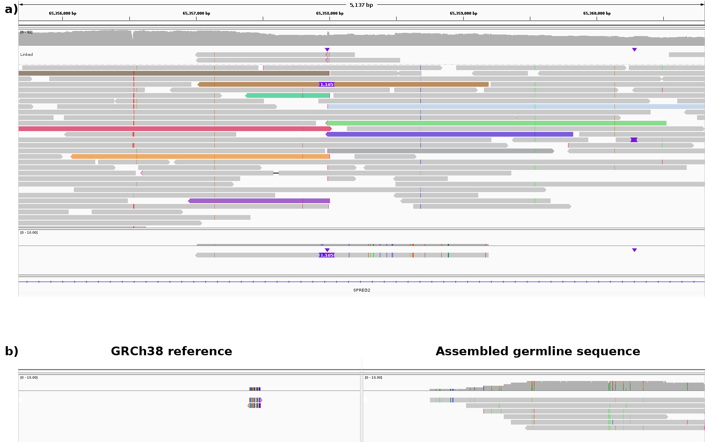

# Filtering of structural variants (SVs)
All cutoffs are adjusted for this dataset
## Coverage filter
- Filtering SVs in regions with abnormal high coverage
  - Sniffles2 annotation **DV > 50**
  - Often Sniffles annotation are not accurate, e.g. because the SV breakpoint is 1-2 bp next to a region with abnormal high coverage. Therefore, mean coverage in a 20 bp segment around each breakpoint is calculate using *samtools bedcov*. SVs with breakpoints in a high coverage segment (**Coverage > 100**) are filtered out.
- Filtering reads with less than 2 or more than 15 supporting reads (**DV < 2 or DV > 15**)
## SV length filter
- Filtering SVs with a length smaller than 5 kb
## PCR duplicate filter

***Figure 1:** Example of an false positive SV call due to a PCR amplified artefact. Both colored reads indicate a translocation to chr16, stem from the same PCR library (Lib2) and have the same mapping positions. IGV image, grouped by library, colored by SA*
- Gathering of supporting reads from the mapping
  - If not all reads are found in a 4 kb segment around each breakpoint the SV is filtered out
- Assembly of SV supporting reads with lamassemble [(Frith et al., 2021)](https://pubmed.ncbi.nlm.nih.gov/33289891/)
- Mapping of SV supporting reads on the assembly using minimap2
- Reads from the same library with similiar start and end positions in this mapping are flagged as duplicates (**distancestart + distanceend < 150**)
- SV with less than 2 unique reads remaing are filtered (**RMDV < 2**)
- Exception for SVs with DV=2 from the same library
  - These SVs are already filtered if **distancestart < 35** or **distanceend < 35**
## Mapping quality filter
- If the mean mapping quality of the reads is below 20 the SV is filterd out (**MQmean < 20**)
## SV position filter
- The standard deviation of the breakpoint positions of the SV are calculated. SV is filtered out if the standard deviaiton is larger than 100.
## Mismatch filter
- If the SV supporting reads have a mismatch frequency above 0.05 and 2.5-times higher than the non-SV supporting reads of the same region the SV is filtered out
## Germline filter
- Known germline SV are filtered by comparion with dbVar Common 1000g
- Unknown germline SVs
  - Reads at breakpoints are analyzed for (1) completly spanning insertions, (2) spanning insertions by supplementary alignment or (3) read pattern indication a long insertion
  - For SVs with (1) and (2) the germline sequence can be assembled
  - SV supporting reads are mapped to a combined reference consisting of two contigs, the assembled germline sequence and the GRCh38 reference sequence. Originally SV supporting reads which map completly on the assembled reference are classified as non-SV supporting reads. SVs that now have too less than 2 reads are filtered out.

*Analysis process of a false positive SV due to a 1.1 kb germline insertion. **a)** Mapping shows two reads spanning the insertion by supplementary alignment (top) and one read spanning the deletion in one alignment (brown colored read). The other colored reads have supplementary mappings to other parts of the genome. **b)** Mapping of all reads with a supplementary alignement (colored in a)) to the GRCh38 reference (left) and assembly of the three SV spanning reads (right). Complete mapping to the assembly indicates that these reads stem from the allele with the germline insertion, but are too short to span the insertion and map correctly, thus leading to false supplementary mappings and a false positive SV call*
