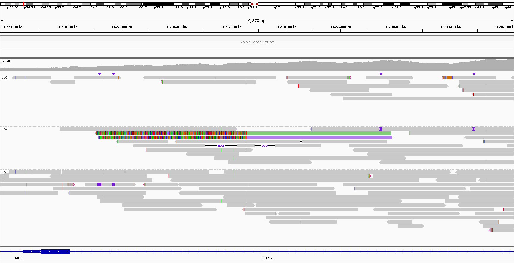

# Filtering of structural variants (SVs)
All cutoffs are adjusted for this dataset
## Coverage filter I
- Filtering SVs in regions with abnormal high coverage
  - Sniffles2 annotation **DV > 50**
  - Often Sniffles annotation are not accurate, e.g. because the SV breakpoint is 1-2 bp next to a region with abnormal high coverage. Therefore, mean coverage in a 20 bp segment around each breakpoint is calculate using *samtools bedcov*. SVs with breakpoints in a high coverage segment (**Coverage > 100**) are filtered out.
- Filtering reads with less than 2 or more than 15 supporting reads (**DV < 2 or DV > 15**)
## SV length filter
- Filtering SVs with a length smaller than 5 kb
## PCR duplicate filter
Example of an false positive SV call due to a PCR amplified artefact. Both colored reads indicate a translocation to chr16 and stem from the same PCR library. IGV image, grouped by library, colored by SA

- Assembly of SV supporting reads with lamassemble [(Frith et al., 2021)](https://pubmed.ncbi.nlm.nih.gov/33289891/)
- Mapping of SV supporting reads on the assembly using minimap2
- Reads from the same library with similiar start and end positions in this mapping (**distance_start + distance_end < 150**)
