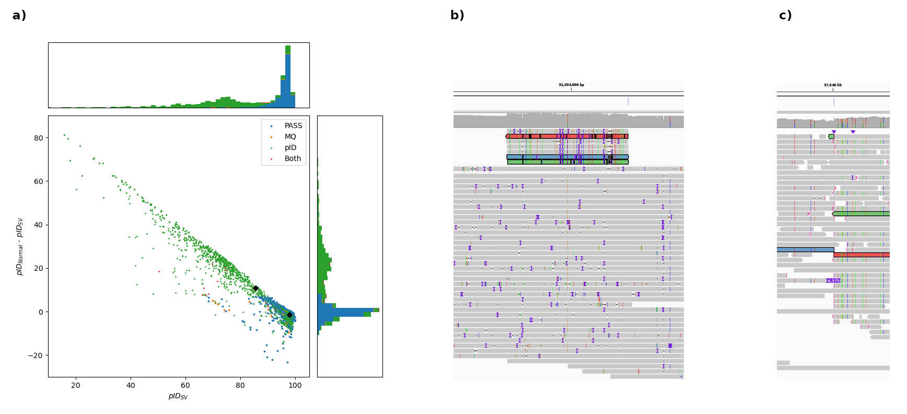

# Filtering of structural variants (SVs)
This script uses a two-step filtering process for removing false-positive SV calls. Excessive amounts of false positive SV calls is a problem in high-sensitivity Sniffles/SV calls, were variants are called with only 3+ supporting reads.

All cutoffs are adjusted for this dataset

## Step 1: Prefiltering
### Mapping quality filter
- Filters a SV if the mean mapping quality of the supporting reads (either at the start or end site) is **<20**
### Mismatch filter
- Calculates the percent identity (pID) of each read in breakpoint region as $^{NM}/_{alignmentlength} \cdot 100$ %
- Mean pID for the SV supporting reads and the normal reads at this region is calculated
- Filtere SV if the mean pID of the SV supporting reads is **<7 %** below the mean pID of the normal reads
- Lower pID is often due to mismapping of an inserted sequence
- Known issue: reads containing a long deletion have elevated NM value -> fix pID calculation
### Coverage filter
- ToDo

**Figure 1:** Application of the prefiltering step to a dataset. **(a)** pID and diff pID values for both breakpoints of SVs in one dataset, colored by different applied filters. One SV is shown as example (black diamonds). **(b)** SV supporting reads (marked) show a 15 % difference in pID at the start breakpoint visible in the alignment. **(c)** This is due to a mismapping of an insertion at the end breakpoint of this SV (visible in one read)

## Step 2: Filtering false positive SVs due to germline insertions
